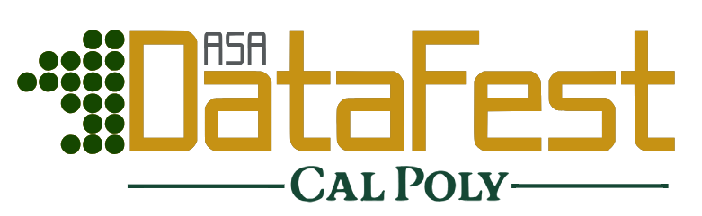

```{r}
#| echo: false
#| out-width: 70%
#| fig-align: center


```

### Getting Started with Software

You are welcome to use any coding language you like at DataFest. Below are tips for getting started with a couple we recommend.

#### R/RStudio

Download and run the R installer for your operating system from CRAN:

 + Windows: <https://cran.rstudio.com/bin/windows/base/>
 + Mac: <https://cran.rstudio.com/bin/macosx/>
 + Linux: <https://cran.rstudio.com/bin/linux/> (pick your distribution)

If you are on  Windows, you should also install the [Rtools4 package](https://cran.rstudio.com/bin/windows/Rtools/); this will ensure you get fewer warnings later when installing packages.

More detailed instructions for  Windows are available [here](https://owi.usgs.gov/R/training-curriculum/installr/)

Download and install the [latest version of RStudio](https://posit.co/download/rstudio-desktop/#download) for your operating system. RStudio is a integrated development environment (IDE) for R, created by Posit. It contains a set of tools designed to make writing R, python, javascript, and other data-related code easier.

#### Python

Download and install the latest version of [python 3](https://www.python.org/downloads/)

+ Windows: check the box that asks if you want to add Python to the system path. This will save you a lot of time and frustration. If you didn’t do this, you can follow [these instructions](https://datatofish.com/add-python-to-windows-path/) to fix the issue (you’ll need to restart your machine).
+ If you’re interested in python, you should install Jupyter using the instructions here (I would just do pip3 install jupyterlab).
+ [Additional instructions for installing Python 3](https://www.py4e.com/lessons/install) from Python for Everybody if you have trouble.

### Computing Resources

+ [Statistical Computing using R and Python](https://srvanderplas.github.io/stat-computing-r-python/) by Susan VanderPlas
+ [R4DS](https://r4ds.hadley.nz/)

### DataFest Workshops

+---------------------------------------------------------------------------------------------------------------------------------------------------------------------------------------------------------------------------+---------------------------------------------------------------+
| **Event**                                                                                                                                                                                                                 | **Date**                                                      |
+---------------------------------------------------------------------------------------------------------------------------------------------------------------------------------------------------------------------------+---------------------------------------------------------------+
| Workshop 1: Python Led by CSC 313 (co-hosted by Stat Club)                                                                                                                                                                | Thursday, March 5th UU hour (11:10-12pm) in 10-125            |
|                                                                                                                                                                                                                           |                                                               |
| *Materials: [slides](workshops/python-csc313-slides.pdf); [cheatsheet](workshops/python-cheatsheet.pdf); [GoogleColab](https://colab.research.google.com/drive/1glzqtZdKtlQ1SR1PzQctD2uLWfxeR5to?usp=sharing)*            |                                                               |
+---------------------------------------------------------------------------------------------------------------------------------------------------------------------------------------------------------------------------+---------------------------------------------------------------+
| Workshop 2: R/Getting Started with Data (co-hosted by Stat Club)                                                                                                                                                          | Thursday, March 12th UU hour (11:10-12pm) in 10-125           |
|                                                                                                                                                                                                                           |                                                               |
| *Materials: [slides](https://docs.google.com/presentation/d/1f6hNYu8WIRUjNfL15WR1T2cCAmmKIypoScvBzBttyQg/edit?usp=sharing); [.qmd file](workshops/r_quartofile.qmd); [Posit Cloud](https://posit.cloud/content/12064067)* |                                                               |
+---------------------------------------------------------------------------------------------------------------------------------------------------------------------------------------------------------------------------+---------------------------------------------------------------+

